# Definex Java Spring Practicum Second Homework - Order Application
### Requirements
- List all the clients.
- List all the invoices.
- List client names whose name has a "C" letter in them.
- Create a system to add new clients.
- List invoices that have a total amount of more than 1500.
- Show the average value of the invoices that have a total amount of more than 1500.
- List the names of customers with invoices amount under 500 in the system.
- List the name and industry of companies with an average invoice amount of less than 750 in June.
- List the invoices of the clients with the registration month in June.
### Maven Command Screenshots
- **Maven Clean**  
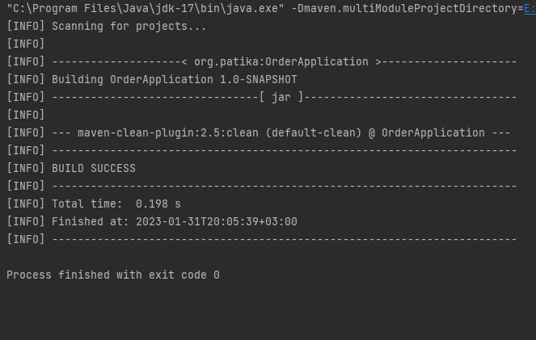
---
- **Maven Install**  
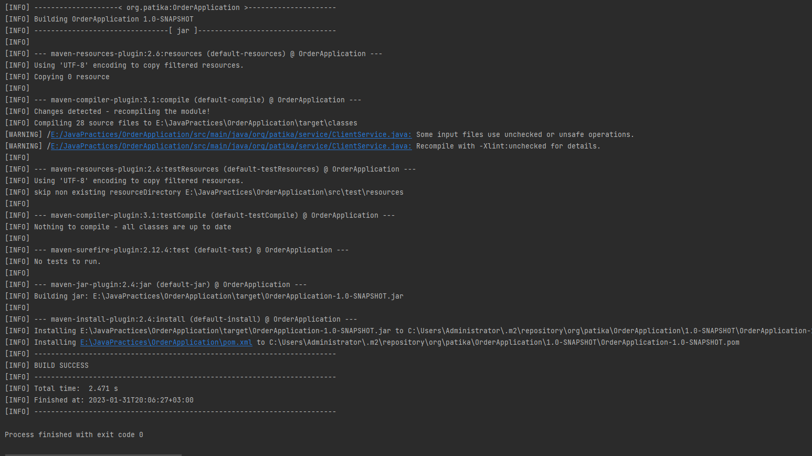
---
- **Maven Build**  
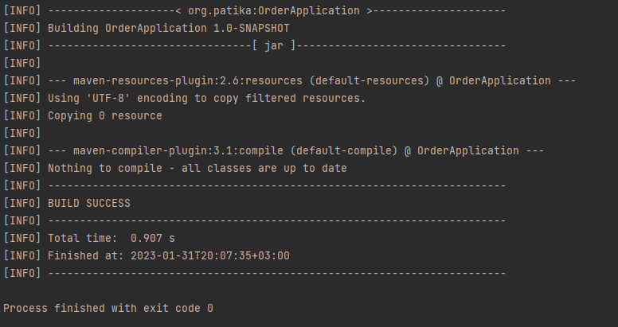
---
### Output:
- **Database data**  
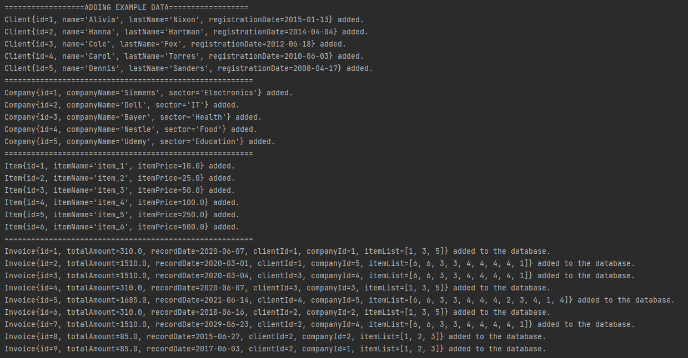
- **Main Menu**  
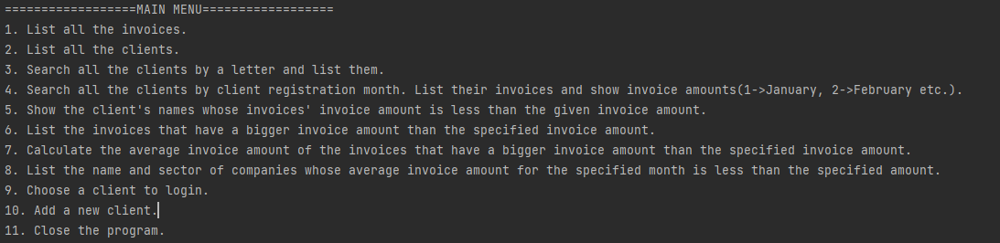
- **List all the clients.**  
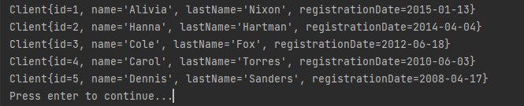
- **List all the invoices.**  
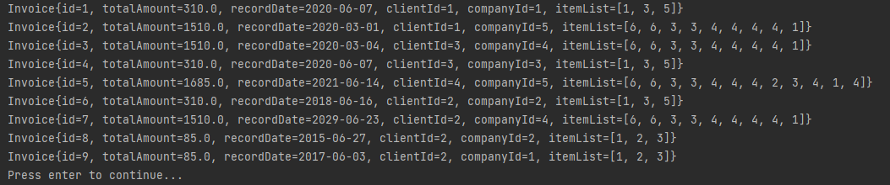
- **List client names whose name has a "C" letter in them.**  
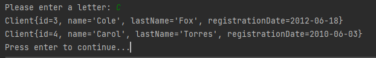
- **List invoices that have a total amount of more than 1500.**  
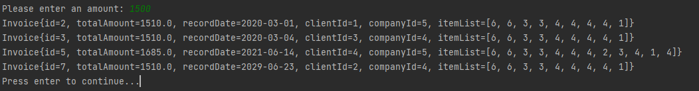
- **Show the average value of the invoices that have a total amount of more than 1500.**  
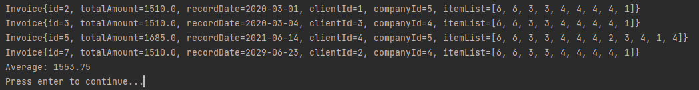
- **List the names of customers with invoices amount under 500 in the system.**  
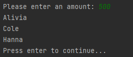
- **List the name and industry of companies with an average invoice amount of less than 750 in June.**  
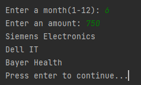
- **List the invoices of the clients with the registration month in June.**  
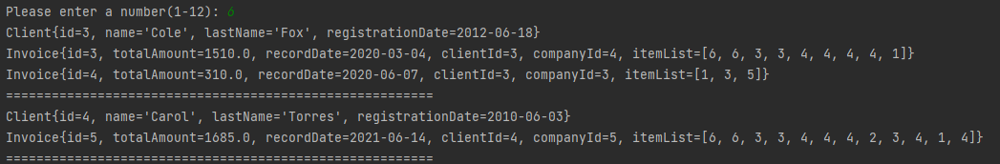
---
- **Add new client.**  
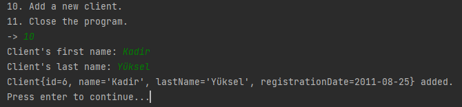
- **List all the client.**  
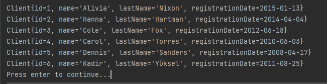
- **Order some items for the new client.**  
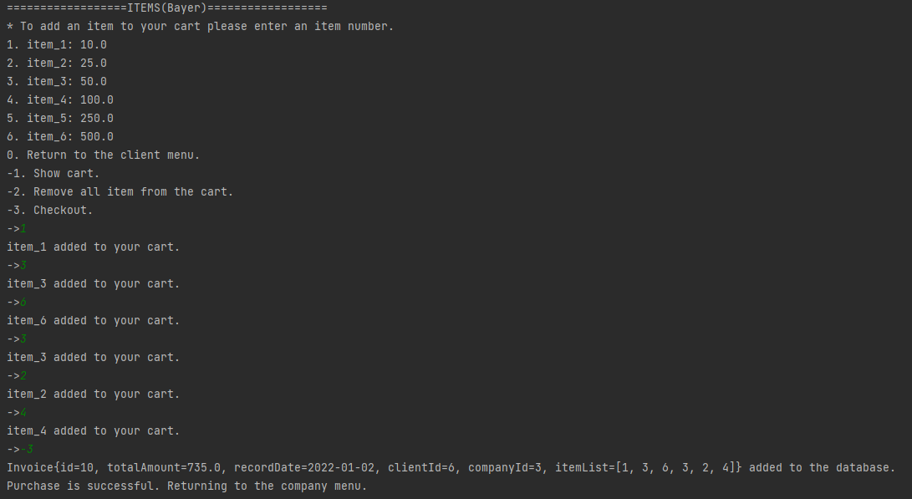
- **Another order for the new client.**  
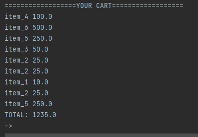
- **List all the invoices after the purchases.**  
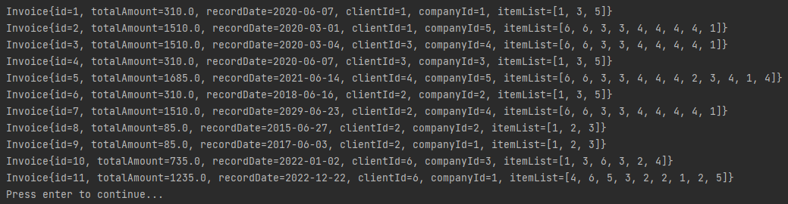

